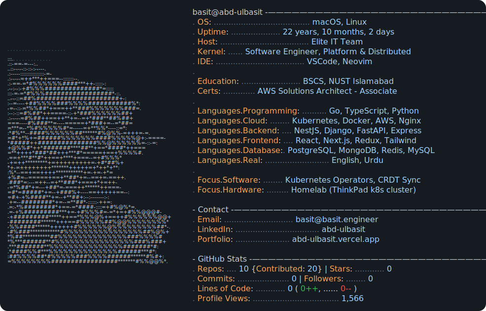

<a href="https://github.com/abd-ulbasit">
  <picture>
    <source media="(prefers-color-scheme: dark)" srcset="dark_mode.svg">
    <source media="(prefers-color-scheme: light)" srcset="light_mode.svg">
    
  </picture>
</a>

<!--
Stats update daily via .github/workflows/build.yaml (today.py).
Card layout/content is generated by scripts/generate_svg.py.
Adapted from https://github.com/Andrew6rant/Andrew6rant
-->
